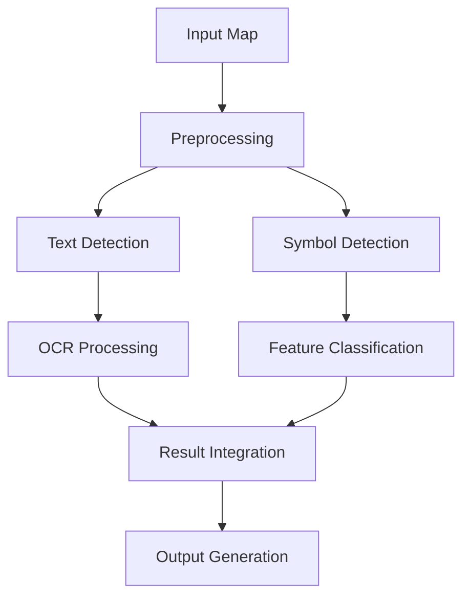

# Technical Documentation

## System Architecture

### Overview

The Indian Topographical Map OCR System is built on a modular architecture with three main components:

1. Text Detection & Recognition
2. Symbol Detection & Classification
3. Result Generation & Visualization



### Core Components

1. **CadastralMapExtractor** (`src/detect.py`)

   - Main processing pipeline
   - Text and symbol detection coordination
   - Result integration and output generation

2. **TopographicalSymbolDetector** (`src/detect.py`)

   - Symbol detection and classification
   - Color-based feature extraction
   - Pattern recognition

3. **Map Processor** (`src/process_map.py`)
   - Image preprocessing
   - Enhancement algorithms
   - Size normalization

### Data Flow

1. **Input Processing**

   ```
   Map Image → Resize → Color Space Conversion → Enhancement
   ```

2. **Feature Detection**

   ```
   Enhanced Image → Color Segmentation → Pattern Detection → Feature Classification
   ```

3. **Text Recognition**

   ```
   Enhanced Image → Text Region Detection → OCR → Post-processing
   ```

4. **Result Generation**
   ```
   Detected Features + OCR Results → Integration → Visualization + Analysis
   ```

### Color Processing

The system uses HSV color space for robust feature detection:

| Feature    | H Range | S Range | V Range |
| ---------- | ------- | ------- | ------- |
| Transport  | 0-10    | 100-255 | 100-255 |
| Water      | 100-130 | 50-255  | 50-255  |
| Boundaries | 40-80   | 40-255  | 40-255  |

### Detection Algorithms

1. **Text Detection**

   - EasyOCR for text recognition
   - Custom post-processing for Indian place names
   - Survey number specific detection

2. **Symbol Detection**

   - Color-based segmentation
   - Contour analysis
   - Shape recognition
   - Pattern matching

3. **Feature Classification**
   - Size-based classification
   - Shape analysis
   - Context-aware categorization

### Performance Optimization

1. **Image Processing**

   - Automatic resizing for large maps
   - Parallel processing where applicable
   - GPU acceleration when available

2. **Memory Management**

   - Efficient numpy operations
   - Batch processing for large datasets
   - Resource cleanup after processing

3. **Output Generation**
   - Optimized visualization
   - Efficient data storage
   - Compressed output formats

## Dependencies

### Core Libraries

- OpenCV: Image processing
- EasyOCR: Text recognition
- NumPy: Numerical operations
- PyTorch: Deep learning backend
- Pandas: Data management

### Version Requirements

```python
opencv-python>=4.5.0
easyocr>=1.6.2
numpy>=1.21.0
torch>=1.9.0
pandas>=1.3.0
```

## Error Handling

The system implements comprehensive error handling:

1. **Input Validation**

   - Image format checking
   - Size validation
   - Color space verification

2. **Processing Errors**

   - OCR failure recovery
   - Detection fallbacks
   - Resource cleanup

3. **Output Generation**
   - File write error handling
   - Format conversion safety
   - Result validation

## Testing

The system includes comprehensive unit tests:

1. **Initialization Tests**

   - System setup
   - Resource availability
   - Configuration loading

2. **Processing Tests**

   - Image loading
   - Color detection
   - Feature extraction

3. **Integration Tests**
   - End-to-end processing
   - Output validation
   - Performance benchmarks
